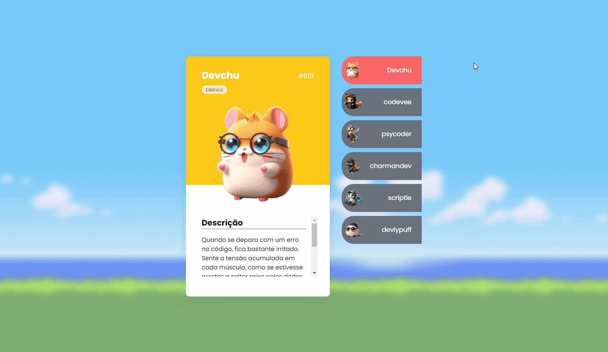

# Projeto com README
Um teste de projeto com README 🚀

[]

## Como utilizar

1 - Clone o projeto com GIT
```
git clone https://github.com/DevJoaoG/repositorio-com-readme
```

2 - Acesse a pasta do projeto
```
cd repositorio-com-readme
```